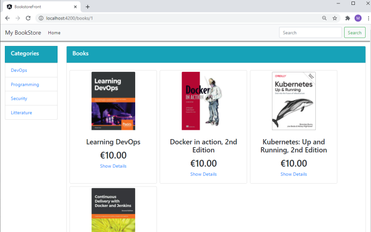

# Deploying a Full Stack Angular 11/ Spring Boot 2.4 /MySQL 8 on Kubernetes
---
# Step 1 : Get the Starter and Run it using Docker Compose 
Click [this link](https://github.com/mromdhani/bookstore-fullstack-on-kubernetes/tree/b61d7b6dee4a9bcb1e11a89aba6367972d7be7ef) to checkout the git commit.

This is the starting point.

- Clone this repository :
```shell
$ git clone https://github.com/mromdhani/bookstore-fullstack-on-kubernetes.git
```
- Build and run it :
```shell
$ docker-compose up --build -d   
```
- Launch your browser and connect to http://localhost:8080
We will see the following User interface. This indicates that the stack is OK.


- Stop the stack, when you have finished your tests.
```shell
$ docker-compose down    
```
Note: In this starter, there Angular App calls the REST Api using its port published on the host. This works, but it is somewhat awkward. We are going to fix it in the next step. 
# Step 2 : Fix the NGinx Configuration to set it as a reverse Proxy 
Click [this link](https://github.com/mromdhani/bookstore-fullstack-on-kubernetes/tree/c0e19e414803716f59b0a741cec2ef42df0b3bac) to checkout the git commit.

In this step, we are fixing the Nginx Configuration in order to use it as a reverse proxy for the Spring REST Api endpoints. By now, Nginx does not only host the static Angular web site, but it forwards the REST calls to the Spring Endpoints.
This this the summary of the change :
- Under the folder `bookstore-front`,  Add a new folder named  `nginx` containing the Nginx configuration file `frontend-nginx.conf`. 
- Update the Dockerfile of the  `bookstore-front` in order to ship the Ngix configuration file within the image.
- Update the way the front application accesses to the REST API.  Consider `bookstore-front/src/environments/environment.prod.ts`, change the `url_base` and set it as follows `'http://spring-service:8080'`

- Launch the docker-compose stack, connect to the UI using your borwser. Shutdown the stack when you have finished your tests.

# Step 3 : Adding Kubernetes manifests, first quick & dirty way 
Click [this link](https://github.com/mromdhani/bookstore-fullstack-on-kubernetes/tree/c5283ecd4423553aea62448de94bbfb4b61f82be) to checkout the git commit.

In this step, we are going to add the first version of our Kubernetes manifests. For each of our three tiers, we add a deployment and a service. But before doing that, we should build the images and send them to some registry
This this the summary of the change :
- Create a new folder named `K8s` under which the manisfests will be added. 
- Build, tag the images, and push them to a registry. In my case, i am using `quay.io` registry by RedHat.
   - CD to front-end folder
 
```shell
$ docker build -t quay.io/mromdhani/bookstore-front .
$ docker push quay.io/mromdhani/bookstore-front
```
    - CD to backend folder

- Back to the folder `K8s`, create the following manifests:
    - `frontend.yaml`. This contains the first version of the deployment and the service for the front tier.
    - `backend-mysql.yaml`. This contains the first version of the deployment and the service for the backend MySQL tier. Environment variable are harcoded. Passwords are visible !. This is will be fixed in the next step.
    -  `backend-api.yaml`. This contains the first version of the deployment and the service for the backend REST API tier. Environment variable are harcoded. Passwords are visible !. This is will be fixed in the next step.

- Apply the manifests using the command `kubectl apply`. You apply do it on the entire K8s folder like so:
   - CD into the main project folder, and type in the following command
```shell
$ kubectl apply -f K8s/
```
- Inspect the pods, inspect the services. If all is OK, launch and connect to the Loadbalancer service related to the bookstore-front Pod. It has the URL `http://localhost:8888`.  
  
- Stop the app using the command 
```shell
$ kubectl delete -f K8s/
```

# Step 4 : Moving Configuration to ConfigMaps and Secrets
Click [this link](https://github.com/mromdhani/bookstore-fullstack-on-kubernetes/tree/3266430310651ae220254ab7839fc0e279045b75) to checkout the git commit.

In this step, we are going to move the configs and the passwords of the different Pods in seperate artifacts.
This this the summary of the change :
- Create a new folder under `K8s` and name it `backend-config`. The Angular front, as per se, has no .
- Under `backend-config`, add the following configmaps and secrets:
      - `backend-api-configs.yaml`
      - `backend-api-secrets.yaml`
      - `backend-mysql-configs.yaml`
      - `backend-mysql-secrets.yaml`

- Update the `backend-end-api` and `backend-end-mysql` manifests in order to use the configs and the secrets. The newer versions of these manifests are named as follows :
      - `backend-api-with-everything-configmap.yaml`
      - `backend-mysql-with-everything-configmap.yaml`
- Apply the new manifests using the command `kubectl apply`. 
- Inspect the pods, inspect the services. If all is OK, launch and connect to the Loadbalancer service related to the bookstore-front Pod. It has the URL `http://localhost:8888`.  
  
- Stop the app using the command `kubectl delete` 


# Step 5 : Using PV and PVC for MySQL Data
Click [this link](https://github.com/mromdhani/bookstore-fullstack-on-kubernetes/tree/1542178b003296f7602b4dd2b58542c9f912b871) to checkout the git commit.

In this step, we are going to set up a Persistent Volume (VP) and a Persistent Volume Claim for the MySQL Pod.
This this the summary of the change :
- Create a new folder under `K8s` and name it `backend-persistece`. 
- Under `backend-persistence`, add the following manifests:
      - `mysql-pv-and-pvc.yaml`
- Update the `backend-end-mysql` to use the VPC. The newer version is the following
      - `backend-mysql-with-everything-configmap-and-pv.yaml`
    
- Apply the new manifests using the command `kubectl apply`. 
- Inspect the pods, inspect the services. If all is OK, launch and connect to the Loadbalancer service related to the bookstore-front Pod. It has the URL `http://localhost:8888`.  
  
- Stop the app using the command using  `kubectl delete`

# Step 6 : Refactoring MySQL Deployments to Replacasets
Click [this link](https://github.com/mromdhani/bookstore-fullstack-on-kubernetes/tree/1472a5b84b60eef5fa96ce23d3474daeb7da0a9e) to checkout the git commit.

In this step, we are going to refactor the MySQL deployment in order to use a StatefulSet composed of a master and two workers. This step is based on [this tutorial](https://kubernetes.io/docs/tasks/run-application/run-replicated-stateful-application/) from Kubernetes official site.
This this the summary of the change :
- Create a new folder under `K8s` and name it `backend-mysql-statefulset`. 
- Under `backend-mysql-statefulset`, add the following manifests:
      - `mysql-configmap.yaml`
      -  `mysql-services.yaml`
      -  `mysql-statefulset.yaml`

- Apply the new manifests using the command `kubectl apply`. 
- Inspect the Statefulset, inspect the services. Check that the three pods are created successfully. If all is OK, launch and connect to the Loadbalancer service related to the bookstore-front Pod. It has the URL `http://localhost:8888`.  
  
- Stop the app using the command using  `kubectl delete`
